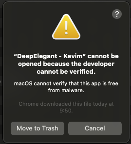
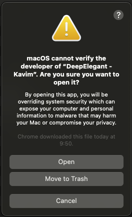

# Open Kavim When macOS Blocks It

macOS Gatekeeper shows a warning the first time you launch Kavim because the app is not yet notarized. The system is simply letting you know the developer hasn’t been verified, but you can still open the app safely.

## What the warning looks like

## Step-by-step: Launch Kavim anyway

### 1. Open from the context menu

1. Locate the `DeepElegant - Kavim` app in Finder (usually in `Downloads`).
2. Right-click (or control-click) the app icon and choose **Open**.

macOS will show a second confirmation dialog:

### 2. Confirm you want to run it

1. When the dialog appears, click **Open**.
2. Kavim will start normally.

:::info No need to repeat next time
After you approve the app once, macOS remembers your choice. Future launches work with a normal double-click.
:::

## If you still can’t open it

- Ensure you’re opening the same file you just downloaded—Gatekeeper re-checks each unique build.
- If you moved Kavim to `Applications`, try the right-click → **Open** flow there.
- As a last resort, you can temporarily allow apps from unidentified developers under **System Settings → Privacy & Security**, but this shouldn’t be necessary after the steps above.

That’s it—you’re ready to brainstorm with Kavim!
