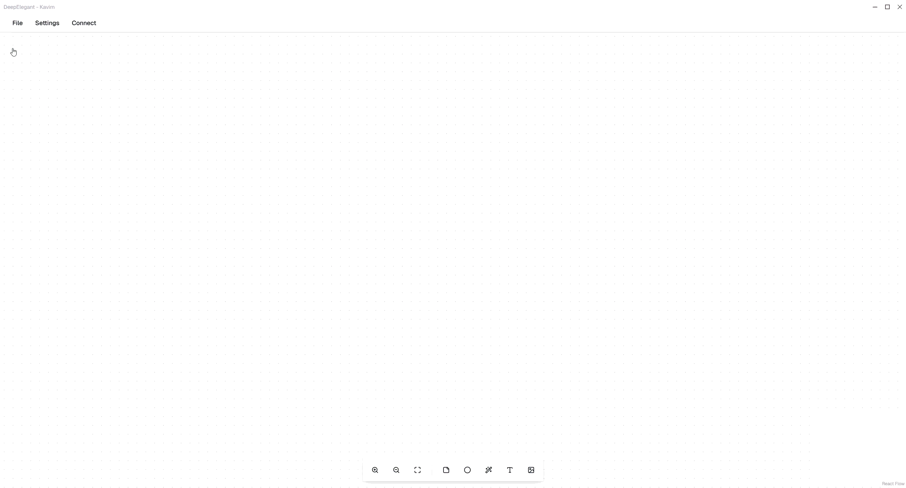
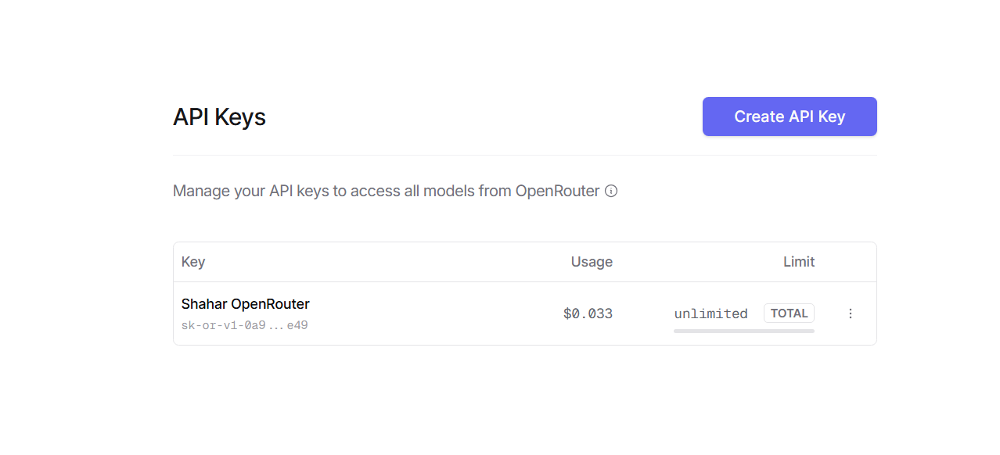
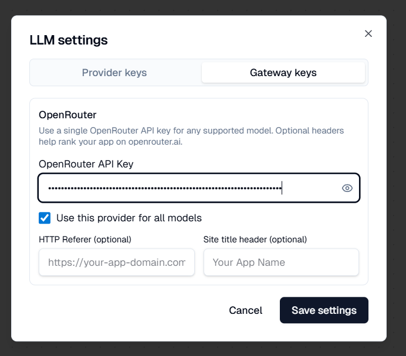
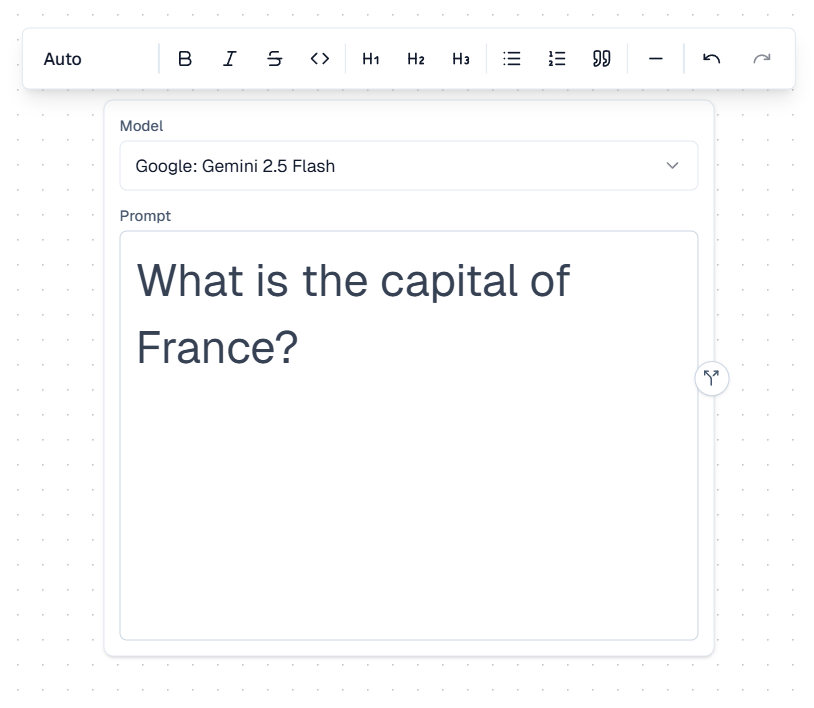

# LLM Settings
This pages gives you a quick overview of **LLM Settings** - how to configure your AI models and how to use them.

## How to use LLM Settings
Kavim supports **two simple ways** to connect your favorite AI models - **Providers** and **Gateways**.

### 🧠 Providers vs. Gateways

**Providers** — Direct connections to AI companies like **OpenAI**, **Anthropic**, **Gemini**, or **DeepSeek**.
Use these if you already have your own API keys.

**Gateways** — Services like **OpenRouter** that connect you to **many models through a single key**.
Perfect if you want easy access to a wide range of models without juggling multiple accounts.

## Quick Start Guide - With Gateway

Get up and running in minutes using **OpenRouter**, a gateway that supports many popular models.

:::warning
Kavim is **not connected or partnered with OpenRouter**.
You’ll need to **create your own OpenRouter account** and manage any billing or usage directly on their site.
:::

### Step 1: Create an OpenRouter account

Go to [openrouter.ai](https://openrouter.ai) and sign up (you can use Google, GitHub, or email).

> 💡 OpenRouter acts as a bridge between you and multiple AI models like Claude, GPT, Gemini, and DeepSeek — all from one place.

### Step 2: Get your API key

1.  Once logged in, open your [**API Keys** page](https://openrouter.ai/settings/keys).

2.  Click **Create Key**, then copy it.

### Step 3: Open Kavim Settings

In the Kavim app:

1.  Click the **Settings** -> **LLM**.

2.  Switch to the **Gateway Keys** tab.

3. Paste your OpenRouter key into the API Key field.

4. Enable “Use this provider for all models” to route all model requests through this provider.

5. Hit **Save Settings**.

That’s it — you’re ready to chat with AIs through your OpenRouter key.

