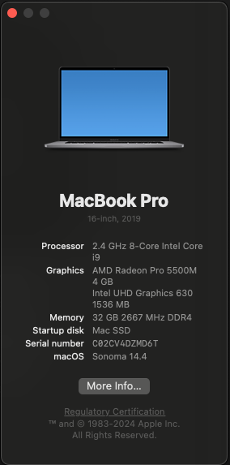
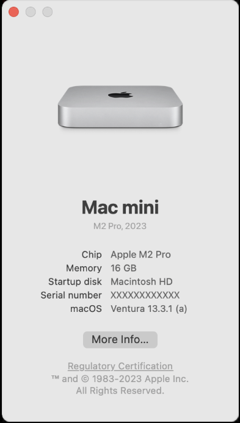

# Choose the Right macOS Download

Picking the correct Kavim installer for macOS takes just a minute and saves you from download errors later.

## 1. Check your Mac's chip

1. Click the  menu in the top-left corner.
2. Select `About This Mac`.

- If the window lists an **Intel** processor, grab the `DeepElegantKavim-darwin-x64.dmg` (or the matching `-x64.zip`).

- If it lists an **Apple M-series chip (M1, M2, M3, M4)**, choose the `DeepElegantKavim-darwin-arm64.dmg` (or the matching `-arm64.zip`).

## 2. Download from the releases page

Head to the [Kavim releases page](https://github.com/deep-elegant/kavim/releases) and download the file that matches your chip.

:::note
The `.dmg` files are the easiest option for most users. The `.zip` archives contain the same build if you prefer to extract the app manually.
:::

## 3. Install and run

1. Open the downloaded file (`.dmg` or `.zip`).
2. Drag **Kavim** into your Applications folder.
3. Launch Kavim — you’re ready to brainstorm!

Need help launching the app the first time? Check the [macOS troubleshooting guide](../troubleshooting/macos-allow-kavim.md).
