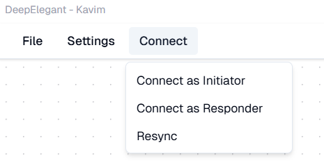
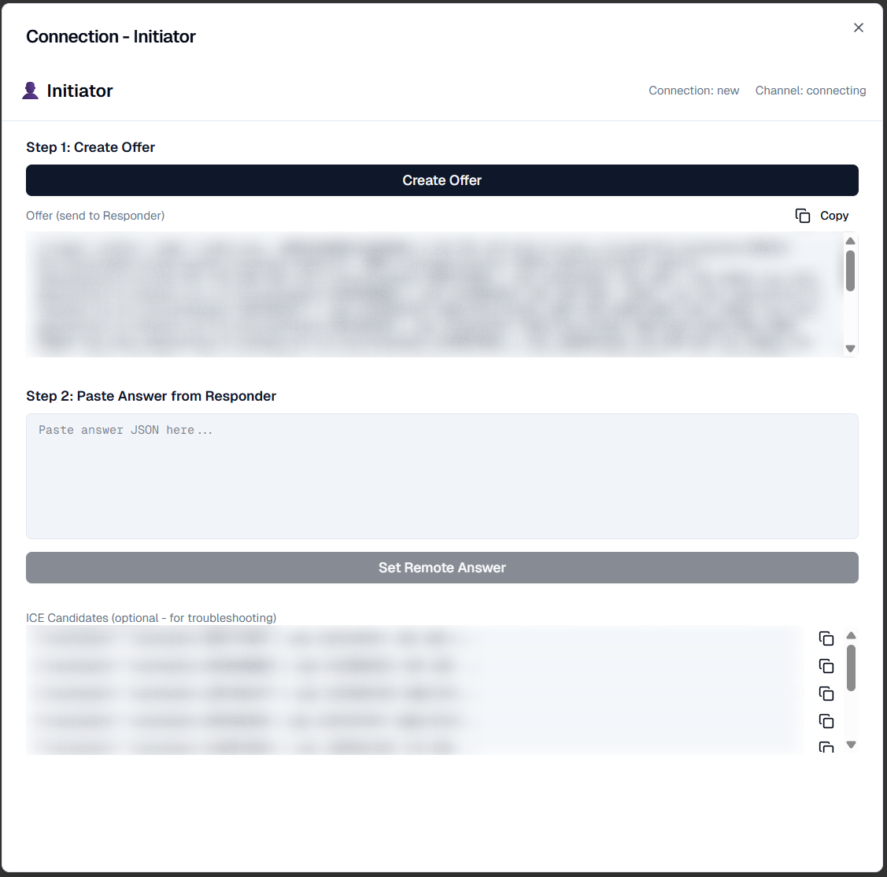
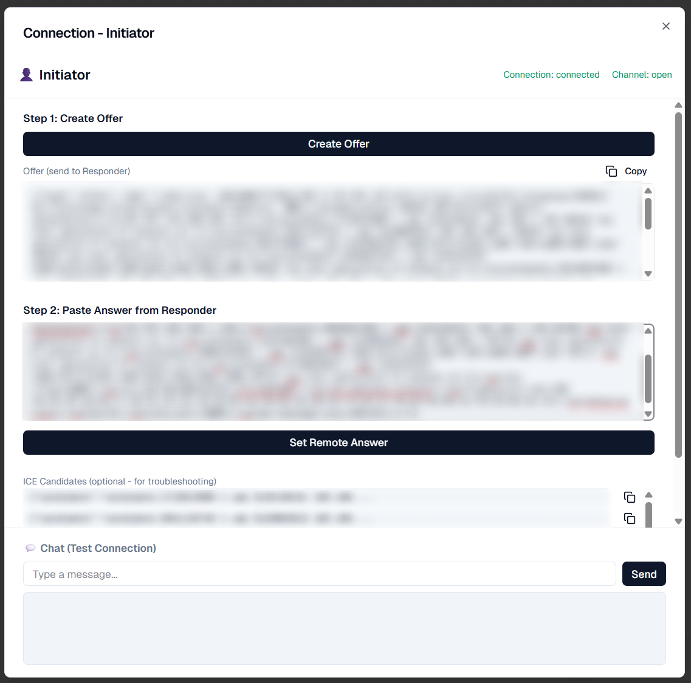

# 🤝 Remote Collaboration

Collaborate with a friend — privately and directly — using **peer-to-peer (P2P)** communication.
No servers, no middlemen — just your devices talking directly over **WebRTC**.

:::tip
> ⚠️ It might look a bit technical the first time, but after one try, you’ll be doing it smoothly in just a few seconds!
:::

## 🧭 Overview

Kavim uses **WebRTC peer-to-peer** connections for live collaboration.
This means your canvas data is shared **directly** between your device and your collaborator’s device — nothing passes through Kavim’s servers.

There are two roles in this process:

-   **Initiator** – the one who starts the connection.

-   **Responder** – the one who accepts and connects back.

You and your friend will share short connection codes to link up and start collaborating.

## ⚙️ Step-by-Step Guide

### 1\. Open the Connect Menu

Go to the top menu and click:

**Connect** -> **Connect as Initiator** / **Connect as Responder**

This opens the **Connection Panel**, where you can choose to connect as either the **Initiator** or **Responder**.

### 2\. Create an Offer (Initiator)

1.  Click **Create Offer**

2.  Kavim will generate a code — this is your **Offer**.

3.  Copy it and send it to your friend (via whatsapp, discord, slack, etc.).

### 3\. Paste the Offer (Responder)

1.  Your friend opens their own Kavim app.

2.  They paste your Offer into the "Offer from Initiator" section.

3.  Kavim will generate an **Answer** code for them.

<video controls src="/videos/responder-create-answer.mp4" width="100%" />

### 4\. Send the Answer Back (Initiator)

1.  Your friend sends you their **Answer** code.

2.  Paste it into your **Remote Answer** field and click **Set Remote Answer**.

3.  Kavim will automatically establish the connection.

> ✅ Once both sides exchange Offer and Answer, you’ll see the connected status — and you can start collaborating live!

## 💡 Tips
-   Use the **Copy** button to copy the connection codes (No need to copy manually and prevent copy-paste errors).
-   You only need to exchange codes once per session.
-   Since it’s direct P2P, performance depends on your network — a stable Wi-Fi helps.
-   Beaware that **firewalls** / **vpn** and other network restrictions might block the connection.

## 🪄 After Your First Time

Once you’ve done it once, you’ll see how easy it is —
just exchange two short codes and you’re collaborating instantly. 💫
